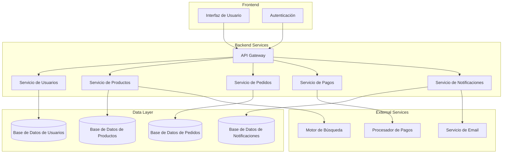

# Documento de Diseño: Plataforma de Marketplace

## Visión General

La plataforma de marketplace es un sistema web que conecta vendedores y compradores en un entorno de comercio electrónico. El sistema permite a los vendedores gestionar sus productos e inventario, mientras que los compradores pueden buscar, comparar y comprar productos de múltiples vendedores.

### Objetivos Principales

- Proporcionar una plataforma escalable para comercio electrónico multi-vendedor
- Garantizar transacciones seguras y confiables
- Ofrecer una experiencia de usuario intuitiva tanto para vendedores como compradores
- Mantener integridad de datos en todas las operaciones

## Arquitectura

### Arquitectura de Alto Nivel



### Patrones Arquitectónicos

**Microservicios**: Cada dominio principal (usuarios, productos, pedidos, pagos, notificaciones) se implementa como un servicio independiente para mejorar escalabilidad y mantenibilidad.

**API Gateway**: Punto único de entrada que maneja autenticación, autorización, rate limiting y enrutamiento de requests.

**Event-Driven Architecture**: Los servicios se comunican a través de eventos para mantener bajo acoplamiento y alta cohesión.

## Componentes e Interfaces

### Servicio de Usuarios

**Responsabilidades:**
- Registro y autenticación de usuarios
- Gestión de perfiles y roles
- Validación de credenciales

**Interfaces Principales:**
```typescript
interface UserService {
  registerUser(userData: UserRegistrationData): Promise<User>
  authenticateUser(credentials: LoginCredentials): Promise<AuthToken>
  updateUserProfile(userId: string, updates: UserProfileUpdates): Promise<User>
  getUserById(userId: string): Promise<User>
}
```

### Servicio de Productos

**Responsabilidades:**
- CRUD de productos
- Gestión de inventario
- Búsqueda y filtrado
- Categorización

**Interfaces Principales:**
```typescript
interface ProductService {
  createProduct(productData: ProductCreationData): Promise<Product>
  updateProduct(productId: string, updates: ProductUpdates): Promise<Product>
  deleteProduct(productId: string): Promise<void>
  searchProducts(query: SearchQuery): Promise<SearchResults>
  updateInventory(productId: string, quantity: number): Promise<Product>
}
```

### Servicio de Pedidos

**Responsabilidades:**
- Gestión del carrito de compras
- Procesamiento de pedidos
- Seguimiento de estados
- Coordinación con inventario y pagos

**Interfaces Principales:**
```typescript
interface OrderService {
  addToCart(userId: string, productId: string, quantity: number): Promise<Cart>
  updateCartItem(userId: string, productId: string, quantity: number): Promise<Cart>
  removeFromCart(userId: string, productId: string): Promise<Cart>
  createOrder(userId: string, cartId: string): Promise<Order>
  updateOrderStatus(orderId: string, status: OrderStatus): Promise<Order>
}
```

### Servicio de Pagos

**Responsabilidades:**
- Procesamiento de pagos
- Integración con procesadores externos
- Gestión de métodos de pago
- Generación de recibos

**Interfaces Principales:**
```typescript
interface PaymentService {
  processPayment(paymentData: PaymentData): Promise<PaymentResult>
  validatePaymentMethod(paymentMethod: PaymentMethod): Promise<boolean>
  generateReceipt(paymentId: string): Promise<Receipt>
  refundPayment(paymentId: string, amount: number): Promise<RefundResult>
}
```

### Servicio de Notificaciones

**Responsabilidades:**
- Envío de notificaciones por email y en plataforma
- Gestión de preferencias de usuario
- Historial de notificaciones
- Triggers automáticos

**Interfaces Principales:**
```typescript
interface NotificationService {
  sendNotification(notification: NotificationData): Promise<void>
  updateUserPreferences(userId: string, preferences: NotificationPreferences): Promise<void>
  getNotificationHistory(userId: string): Promise<Notification[]>
  scheduleNotification(notification: ScheduledNotification): Promise<void>
}
```
## Modelos de Datos

### Usuario
```typescript
interface User {
  id: string
  email: string
  passwordHash: string
  role: 'buyer' | 'seller'
  profile: UserProfile
  createdAt: Date
  updatedAt: Date
}

interface UserProfile {
  firstName: string
  lastName: string
  phone?: string
  address?: Address
  preferences: UserPreferences
}
```

### Producto
```typescript
interface Product {
  id: string
  sellerId: string
  name: string
  description: string
  price: number
  currency: string
  category: string
  images: string[]
  inventory: InventoryInfo
  status: 'active' | 'inactive' | 'out_of_stock'
  createdAt: Date
  updatedAt: Date
}

interface InventoryInfo {
  quantity: number
  lowStockThreshold: number
  trackInventory: boolean
}
```

### Pedido
```typescript
interface Order {
  id: string
  buyerId: string
  sellerId: string
  items: OrderItem[]
  totalAmount: number
  currency: string
  status: OrderStatus
  shippingAddress: Address
  paymentInfo: PaymentInfo
  trackingNumber?: string
  createdAt: Date
  updatedAt: Date
}

interface OrderItem {
  productId: string
  quantity: number
  unitPrice: number
  totalPrice: number
}

type OrderStatus = 'pending' | 'confirmed' | 'processing' | 'shipped' | 'delivered' | 'cancelled'
```

### Carrito
```typescript
interface Cart {
  id: string
  userId: string
  items: CartItem[]
  totalAmount: number
  currency: string
  createdAt: Date
  updatedAt: Date
}

interface CartItem {
  productId: string
  quantity: number
  unitPrice: number
  totalPrice: number
}
```
## Propiedades de Corrección

*Una propiedad es una característica o comportamiento que debe mantenerse verdadero en todas las ejecuciones válidas del sistema - esencialmente, una declaración formal sobre lo que el sistema debe hacer. Las propiedades sirven como puente entre las especificaciones legibles por humanos y las garantías de corrección verificables por máquina.*

### Propiedades de Gestión de Usuarios

**Propiedad 1: Registro exitoso con información válida**
*Para cualquier* información de usuario válida, el registro debe crear una cuenta y enviar confirmación por email
**Valida: Requisitos 1.1**

**Propiedad 2: Rechazo de emails duplicados**
*Para cualquier* intento de registro con email ya existente, el sistema debe rechazar el registro y mostrar mensaje de error
**Valida: Requisitos 1.2**

**Propiedad 3: Autenticación exitosa**
*Para cualquier* usuario registrado con credenciales válidas, el inicio de sesión debe autenticar y redirigir al dashboard correspondiente
**Valida: Requisitos 1.3**

**Propiedad 4: Actualización de perfil**
*Para cualquier* actualización válida de perfil, los cambios deben guardarse inmediatamente
**Valida: Requisitos 1.4**

**Propiedad 5: Selección de rol**
*Para cualquier* usuario durante el registro, debe poder elegir entre rol de vendedor o comprador
**Valida: Requisitos 1.5**

### Propiedades de Gestión de Productos

**Propiedad 6: Creación de productos**
*Para cualquier* producto con información completa, debe guardarse y hacerse visible en el catálogo
**Valida: Requisitos 2.1**

**Propiedad 7: Actualización de productos**
*Para cualquier* actualización válida de producto, los cambios deben reflejarse inmediatamente
**Valida: Requisitos 2.2**

**Propiedad 8: Eliminación de productos**
*Para cualquier* producto eliminado, debe removerse del catálogo y cancelar pedidos pendientes
**Valida: Requisitos 2.3**

**Propiedad 9: Validación de campos obligatorios**
*Para cualquier* intento de guardar producto, todos los campos obligatorios deben estar completos
**Valida: Requisitos 2.4**

**Propiedad 10: Inventario cero marca no disponible**
*Para cualquier* producto cuyo inventario llegue a cero, debe marcarse como no disponible
**Valida: Requisitos 2.5**

### Propiedades de Búsqueda y Navegación

**Propiedad 11: Búsqueda por término**
*Para cualquier* término de búsqueda, debe retornar productos relevantes ordenados por relevancia
**Valida: Requisitos 3.1**

**Propiedad 12: Filtrado de productos**
*Para cualquier* combinación de filtros aplicados, debe mostrar solo productos que cumplan todos los criterios
**Valida: Requisitos 3.2**

**Propiedad 13: Navegación por categorías**
*Para cualquier* navegación por categorías, debe mostrar productos organizados jerárquicamente
**Valida: Requisitos 3.3**

**Propiedad 14: Información básica en resultados**
*Para cualquier* resultado de búsqueda, debe mostrar información básica del producto
**Valida: Requisitos 3.4**

### Propiedades del Carrito de Compras

**Propiedad 15: Adición al carrito**
*Para cualquier* producto añadido al carrito, debe agregarse y actualizar el total correctamente
**Valida: Requisitos 4.1**

**Propiedad 16: Modificación de cantidades**
*Para cualquier* modificación de cantidad en el carrito, debe recalcular totales automáticamente
**Valida: Requisitos 4.2**

**Propiedad 17: Eliminación del carrito**
*Para cualquier* producto eliminado del carrito, debe removerse y actualizar totales
**Valida: Requisitos 4.3**

**Propiedad 18: Persistencia del carrito**
*Para cualquier* usuario autenticado, el carrito debe persistir entre sesiones
**Valida: Requisitos 4.4**

**Propiedad 19: Limitación por inventario**
*Para cualquier* cantidad solicitada que exceda el inventario, debe limitarse a la cantidad disponible
**Valida: Requisitos 4.5**
### Propiedades de Procesamiento de Pedidos

**Propiedad 20: Confirmación de pedido**
*Para cualquier* pedido confirmado, debe validar inventario y procesar el pago
**Valida: Requisitos 5.1**

**Propiedad 21: Pago exitoso**
*Para cualquier* pago exitoso, debe crear el pedido y reducir inventario
**Valida: Requisitos 5.2**

**Propiedad 22: Pago fallido**
*Para cualquier* pago fallido, debe mantener el carrito y mostrar mensaje de error
**Valida: Requisitos 5.3**

**Propiedad 23: Confirmación por email**
*Para cualquier* pedido creado, debe enviar confirmación por email al comprador y vendedor
**Valida: Requisitos 5.4**

**Propiedad 24: Número de seguimiento único**
*Para cualquier* pedido creado, debe generar un número único de seguimiento
**Valida: Requisitos 5.5**

### Propiedades de Gestión de Pedidos

**Propiedad 25: Notificación de nuevo pedido**
*Para cualquier* pedido creado, debe notificar al vendedor inmediatamente
**Valida: Requisitos 6.1**

**Propiedad 26: Notificación de actualización de estado**
*Para cualquier* actualización de estado de pedido, debe notificar al comprador
**Valida: Requisitos 6.2**

**Propiedad 27: Cambios de estado válidos**
*Para cualquier* pedido, debe permitir cambios a estados válidos (procesado, enviado, entregado)
**Valida: Requisitos 6.3**

**Propiedad 28: Información de tracking**
*Para cualquier* pedido marcado como enviado, debe solicitar información de tracking
**Valida: Requisitos 6.4**

**Propiedad 29: Historial de cambios**
*Para cualquier* pedido con cambios de estado, debe mostrar historial completo
**Valida: Requisitos 6.5**

### Propiedades del Sistema de Pagos

**Propiedad 30: Encriptación de información sensible**
*Para cualquier* pago procesado, toda la información sensible debe estar encriptada
**Valida: Requisitos 7.2**

**Propiedad 31: Motivo de rechazo**
*Para cualquier* pago rechazado, debe mostrar el motivo específico del rechazo
**Valida: Requisitos 7.3**

**Propiedad 32: Múltiples métodos de pago**
*Para cualquier* método de pago soportado (tarjetas, PayPal, transferencias), debe funcionar correctamente
**Valida: Requisitos 7.4**

**Propiedad 33: Generación de recibo**
*Para cualquier* pago completado, debe generar recibo digital inmediatamente
**Valida: Requisitos 7.5**

### Propiedades de Notificaciones

**Propiedad 34: Envío de notificaciones**
*Para cualquier* evento relevante, debe enviar notificación por email y/o en la plataforma
**Valida: Requisitos 8.1**

**Propiedad 35: Configuración de preferencias**
*Para cualquier* usuario, debe permitir configurar preferencias de notificación
**Valida: Requisitos 8.2**

**Propiedad 36: Notificación de cambio de precio**
*Para cualquier* producto en lista de deseos que baje de precio, debe notificar al comprador
**Valida: Requisitos 8.3**

**Propiedad 37: Notificación de inventario bajo**
*Para cualquier* producto con inventario bajo, debe notificar al vendedor
**Valida: Requisitos 8.4**

**Propiedad 38: Historial de notificaciones**
*Para cualquier* usuario con notificaciones, debe mantener historial completo
**Valida: Requisitos 8.5**
## Manejo de Errores

### Estrategia General

**Principios de Manejo de Errores:**
- Fallar rápido y de manera segura
- Proporcionar mensajes de error claros y accionables
- Mantener integridad de datos en caso de fallos
- Registrar errores para análisis y debugging

### Categorías de Errores

**Errores de Validación:**
- Datos de entrada inválidos
- Violaciones de reglas de negocio
- Campos obligatorios faltantes

**Errores de Sistema:**
- Fallos de base de datos
- Servicios externos no disponibles
- Timeouts de red

**Errores de Autorización:**
- Usuarios no autenticados
- Permisos insuficientes
- Tokens expirados

### Manejo Específico por Servicio

**Servicio de Usuarios:**
- Email duplicado → Error 409 con mensaje específico
- Credenciales inválidas → Error 401 sin revelar detalles
- Datos de perfil inválidos → Error 400 con validaciones específicas

**Servicio de Productos:**
- Producto no encontrado → Error 404
- Inventario insuficiente → Error 409 con cantidad disponible
- Campos obligatorios faltantes → Error 400 con lista de campos

**Servicio de Pedidos:**
- Carrito vacío → Error 400
- Producto no disponible → Error 409 con alternativas
- Fallo de pago → Error 402 con motivo específico

## Estrategia de Testing

### Enfoque Dual de Testing

**Tests Unitarios:**
- Verifican ejemplos específicos y casos límite
- Validan condiciones de error
- Prueban integración entre componentes
- Se enfocan en comportamientos concretos y determinísticos

**Tests Basados en Propiedades:**
- Verifican propiedades universales en múltiples entradas
- Proporcionan cobertura exhaustiva a través de randomización
- Validan invariantes del sistema
- Cada test debe ejecutar mínimo 100 iteraciones

### Configuración de Property-Based Testing

**Framework:** Se utilizará una librería de property-based testing apropiada para el lenguaje de implementación (por ejemplo, fast-check para TypeScript/JavaScript, Hypothesis para Python, QuickCheck para Haskell).

**Configuración de Tests:**
- Mínimo 100 iteraciones por test de propiedad
- Cada test debe referenciar su propiedad del documento de diseño
- Formato de etiqueta: **Feature: marketplace-platform, Property {número}: {texto de la propiedad}**

### Estrategia de Testing por Componente

**Servicio de Usuarios:**
- Tests unitarios: casos específicos de registro, login, actualización
- Tests de propiedades: validación universal de datos, unicidad de emails
- Tests de integración: flujo completo de autenticación

**Servicio de Productos:**
- Tests unitarios: CRUD específico, validaciones de campos
- Tests de propiedades: consistencia de inventario, búsqueda y filtrado
- Tests de integración: sincronización con motor de búsqueda

**Servicio de Pedidos:**
- Tests unitarios: cálculos específicos, estados de pedido
- Tests de propiedades: integridad del carrito, consistencia de totales
- Tests de integración: flujo completo de compra

**Servicio de Pagos:**
- Tests unitarios: casos específicos de pago, validaciones
- Tests de propiedades: integridad de transacciones, encriptación
- Tests de integración: comunicación con procesadores externos

**Servicio de Notificaciones:**
- Tests unitarios: formatos específicos, preferencias
- Tests de propiedades: entrega de notificaciones, historial
- Tests de integración: triggers automáticos

### Datos de Prueba

**Generadores Inteligentes:**
- Usuarios válidos e inválidos con variaciones realistas
- Productos con diferentes categorías, precios y estados de inventario
- Carritos con combinaciones variadas de productos
- Pedidos en diferentes estados del ciclo de vida
- Escenarios de pago exitosos y fallidos

**Invariantes del Sistema:**
- La suma de items en carrito debe igualar el total calculado
- El inventario nunca debe ser negativo
- Los pedidos deben mantener trazabilidad completa
- Las notificaciones deben corresponder a eventos reales